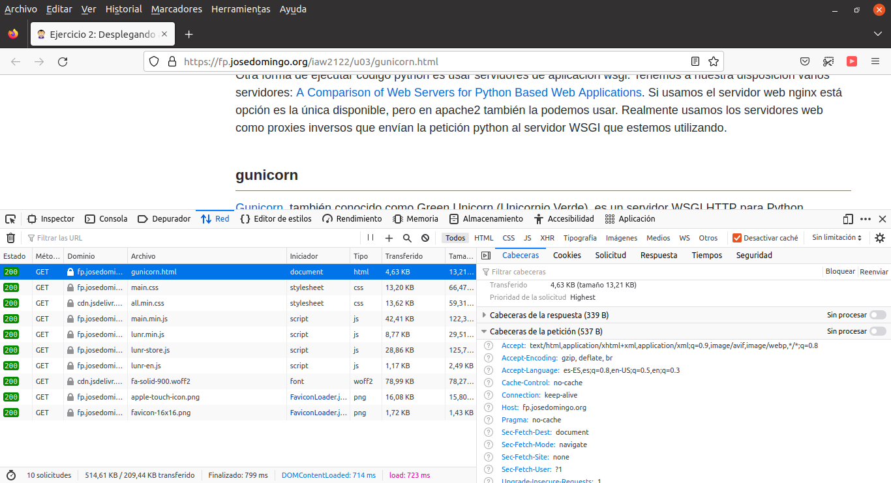

# Weather-App

:partly_sunny::cloud_with_rain::cloud_with_lightning:

A simple Weather Checking Application built in Flask made to track current weather in any city of the world. Uses [OpenWeatherMap API](https://openweathermap.org/). 

Scroll down to see the **Instructions** on how to launch this project properly. 

## Preview 


## Instructions

Clone this repository, cd into it

```
git clone https://github.com/hatredholder/Flask-Weather-App.git
cd Flask-Weather-App
```    

Start a new **Virtualenv**, activate it, install Python module requirements

```
virtualenv myenv
source myenv/bin/activate
pip install -r requirements.txt
```  
Run the **Flask** server

```
python run.py
```  

## Technologies

Frontend: Basic HTML, Bulma.

Backend: Flask.

Database: SQLite.

## Objetivo:
Poner en marcha una web escrita en python (flask) de tres formas diferentes: 
* con apache2 + wsgi
* con apache2 + gunicorn/uwsgi 
* con nginx + gunicorn/uwsgi.

## Instrucciones para clase:

### Instalación con apache2 + wsgi

Sigue las instrucciones del ejercicio anterior

### Instalación con apache2 + gunicorn/uwsgi

Sigue las instrucciones de https://fp.josedomingo.org/iaw2122/u03/gunicorn.html

### Instalación con nginx + gunicorn/uswgi

Sigue las instrucciones de https://fp.josedomingo.org/iaw2122/u03/gunicorn.html

## Capturas
Añade capturas de pantalla de las tres configuraciones. Muestra el contenido de las cabederas. Puedes usar el comando `curl -I http://localhost:puerto` o las developer tools del navegador como aquí: 
